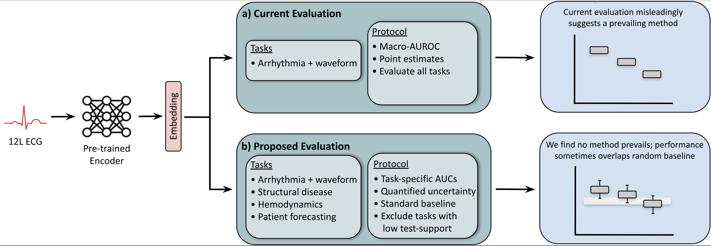

# Evaluation of ECG Representations Must Be Fixed

### [Project Page](https://ecgfix.csail.mit.edu/) | [Paper](https://arxiv.org/pdf/2602.17531)

Published in ICML 2026 position track.

Authors:
[Zachary Berger](https://zackberger.com/)\*,
[Daniel Prakah-Asante](https://www.linkedin.com/in/daniel-prakah-asante)\*,
[John Guttag](https://people.csail.mit.edu/guttag/),
[Collin Stultz](https://hst.mit.edu/faculty-research/faculty/stultz-collin/)

\*equal contribution

This repo reproduces the results on the public datasets from our paper,
["Position: Evaluation of ECG Representations Must Be Fixed"](https://arxiv.org/pdf/2602.17531).




## Setup

### Environment
Create and activate an environment from the repository root:

```bash
conda create -n ecg-fix python=3.11 -y
conda activate ecg-fix
python -m pip install --no-cache-dir -r requirements.txt
```


### Download Models

We evaluated five modern pretrained ECG encoders:
[D-BETA](https://github.com/manhph2211/D-BETA),
[MERL](https://github.com/cheliu-computation/MERL-ICML2024),
[CLOCS](https://github.com/danikiyasseh/CLOCS),
[KED](https://github.com/control-spiderman/ECGFM-KED),
[HeartLang](https://github.com/PKUDigitalHealth/HeartLang).

To obtain weights for these models, log in to the Hugging Face CLI
then download the released weights into `model_weights_dir`:

```bash
hf auth login
hf download doprakah/ecg-fix-weights --local-dir model_weights
```

Expected checkpoint filenames, matching the actual files in `model_weights/`.
In particular, the CLOCS checkpoint is extensionless, while MERL and HeartLang
use `.pth` and D-BETA/KED use `.pt`.

| Model | File |
| --- | --- |
| D-BETA config | `dbeta_config.json` |
| D-BETA weights | `dbeta_best.pt` |
| MERL | `res18_best_encoder.pth` |
| CLOCS | `best_weights_clocs` |
| KED | `ked.pt` |
| HeartLang | `heart.pth` |


### Download Data

We run an empirical study on six evaluation settings, four of which are publicly
available:
[PTB-XL](https://physionet.org/content/ptb-xl/1.0.3/),
[CPSC2018](https://physionet.org/content/challenge-2020/1.0.2/training/cpsc_2018/),
[CSN](https://physionet.org/content/ecg-arrhythmia/1.0.0/),
[EchoNext](https://physionet.org/content/echonext/1.1.0/).

EchoNext requires you to make an account on ```physionet.org``` and accept their
data use agreement (DUA). Once you have done that, download the datasets:
```bash
# Download all datasets. The PhysioNet username enables downloading EchoNext.
bash scripts/download_all_datasets.sh --physionet-user YOUR_USERNAME

# Download all datasets except for EchoNext.
bash scripts/download_all_datasets.sh --skip-restricted

# Download individual datasets.
bash scripts/download_ptb_xl.sh
bash scripts/download_challenge_2020_cpsc2018.sh
bash scripts/download_ecg_arrhythmia.sh  # CSN
bash scripts/download_echonext.sh --physionet-user YOUR_USERNAME
```

These scripts use `wget` and install the data to `./physionet.org/files` by
default. Pass `--dir PATH` to use a different install directory, e.g.,
```bash
bash scripts/download_ptb_xl.sh --dir /path/to/physionet.org/files
```


### Configuration File

The evaluation pipeline reads a `config.json` file from the repository root.
Before running the experiments, make sure the paths are correct, especially
if you didn't install the data to the default directory.

| Field | Explanation |
|---|---|
| `physionet_dir` | Base directory containing downloaded PhysioNet datasets. |
| `dataset_roots` | Dataset-specific paths for each downloaded dataset. |
| `raw_data_dir` | Directory for intermediate raw and preprocessed arrays. |
| `processed_dir` | Directory for formatted metadata and split files used by the data loaders. |
| `embeddings_dir` | Directory where frozen embeddings are saved. |
| `results_dir` | Directory for prediction files, metric files, and completion markers. |
| `tables_dir` | Directory for CSV tables and statistical comparison exports. |
| `model_weights_dir` | Directory containing pretrained model checkpoints. |
| `seed` | Shared random seed used across experiments. |
| `embedding.chunk_size` | Number of models to load. |
| `multi_process_eval` | Number of parallel linear-probe evaluation workers. |
| `eval.num_workers` | Number of `DataLoader` workers used when loading saved embeddings during linear-probe evaluation. The default is `0` because evaluation reads precomputed `.npy` embeddings. |
| `eval.sklearn_n_jobs` | Per-evaluation sklearn parallelism. Keep this low when `multi_process_eval` is greater than `1` to avoid nested oversubscription. |


## Run Experiments

To reproduce all of the results on public datasets from our paper, run the
following command from the repository root:

```bash
python -m src.main --datasets all --models all
```

This preprocesses the data, forms train/val/test splits, precomputes embeddings
for the selected models, trains and evaluates linear probes at 1%, 10%, and
100% of the data, exports the results, and runs statistical tests.

You can also run a subset of the evaluation. Some examples:

```bash
# One PTB-XL task with one model
python -m src.main --datasets PTBXL_super --models D_BETA

# All PTB-XL tasks with several pretrained models
python -m src.main --datasets PTBXL --models D_BETA MERL CLOCS HeartLang KED

# CPSC and CSN with the random baseline grid
python -m src.main --datasets CPSC CSN --models Random
```


### Available Datasets and Models

The `--datasets` and `--models` arguments accept either shortcuts or exact names.

#### Dataset options

| Option | Expands to / Description |
|---|---|
| `all` | `PTBXL_form`, `PTBXL_super`, `PTBXL_sub`, `PTBXL_rhythm`, `PTBXL_C_form`, `PTBXL_C_sub`, `PTBXL_C_rhythm`, `CPSC`, `CSN`, `ECHO_NEXT`. |
| `PTBXL` | `PTBXL_form`, `PTBXL_super`, `PTBXL_sub`, `PTBXL_rhythm`. |
| `PTBXL_C` | Cleaned PTB-XL datasets. `PTBXL_C_form`, `PTBXL_C_sub`, `PTBXL_C_rhythm`. |
| `CPSC` | CPSC task. |
| `CSN` | CSN task. |
| `ECHO_NEXT` | EchoNext task. |

#### Model options

| Option | Expands to / Description |
|---|---|
| `all` | All core pretrained models and all random-initialized baselines. |
| `D_BETA` | D-BETA pretrained encoder. |
| `MERL` | MERL pretrained encoder. |
| `CLOCS` | CLOCS pretrained encoder. |
| `HeartLang` | HeartLang pretrained encoder. |
| `KED` | ECGFM-KED pretrained encoder. |
| `Random` | All random-initialized baselines. |
| `Random_Resnet` or `Random_Resnet18` | All random-initialized ResNet-18 baselines. |
| `Random_Vit` | All random-initialized ViT baselines. |


### Using GPU

Set `CUDA_VISIBLE_DEVICES` before running the experiment. Some examples:

```bash
CUDA_VISIBLE_DEVICES=0 python -m src.main --datasets PTBXL_super --models D_BETA
CUDA_VISIBLE_DEVICES=0,1 python -m src.main --datasets CPSC CSN --models Random
```


## Outputs

The experiment runner outputs precomputed embeddings along with a metadata file:

```text
./data/embeddings/<dataset>/<split>/<model>.npy       # Embeddings
./data/embeddings/<dataset>/<split>/<model>_y.npy     # Labels
./data/embeddings/<dataset>/<split>/<model>_done.json # Metadata
```

Evaluation files are written under:

```text
./data/results/<dataset>/<train_pct>/<model>/<model>.pkl         # Prediction output
./data/results/<dataset>/<train_pct>/<model>/<model>_dataset.pkl # Dataset stats
./data/results/<dataset>/<train_pct>/<model>/<model>_metric.pkl  # Computed metrics
./data/results/done/                                             # Metadata
```

CSV exports are written to the path marked `tables_dir`, in `config.json`,
which defaults to `metrics`. These are the results published in our paper:

```text
./metrics/
  tables/
    summary/
      macro_auc_auprc_table.csv
    tasks/
      <dataset>/
    ptbxl_clean_comparison/
      ptbxl_macroauc_change_*.csv
    random_grid/
      random_grid_*.csv
  stats_tests/
    <dataset>/
      trainpct_<pct>/
        <target>/
          <metric>/
            p_values.csv
            sig_alpha_<alpha>.csv
```

To rerun a specific evaluation result, delete the corresponding model result
folder, for example `./data/results/PTBXL_super/1.0/D_BETA`. You can also regenerate
embeddings by deleting the corresponding folder under
`./data/embeddings/<dataset>/<split>/`.


## Citation
If you found our work useful, please cite our paper:
```
@misc{berger2026ECGfix,
      title={Position: Evaluation of ECG Representations Must Be Fixed}, 
      author={Zachary Berger and Daniel Prakah-Asante and John Guttag and Collin M. Stultz},
      year={2026},
      eprint={2602.17531},
      archivePrefix={arXiv},
      primaryClass={cs.LG},
      url={https://arxiv.org/abs/2602.17531}, 
}
```